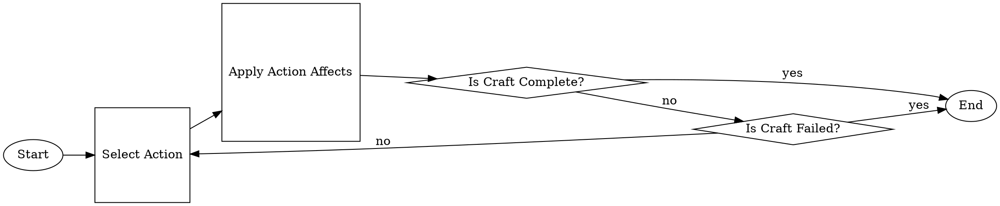

# Proposal - [PROJECT_NAME]

<!-- TODO: PROJECT_NAME -->

## Authors

- [Shannon Conneilly](mailto:Shannon_Conneilly@student.uml.edu)
- [Carlton Perkins](mailto:Carlton_Perkins@student.uml.edu)

## Problem Statement

Final Fantasy XIV is a massively multiplayer online game developed by Square Enix. As part of its gameplay, players can craft items. They do this by using skills to increase the item's quality and to make progress toward its completion. This system is popular enough and has enough depth that they have recently created a form of "competitive" crafting.

The crafts that players synthesize for this purpose are called "expert crafts." They are much more difficult than normal crafts, have a modified set of rules, and can only be synthesized for the purpose of competition. Players must increase the craft's quality to a minimum value and complete the craft without breaking it, or the item is worthless. Competitors have ten days to get as many points as possible.

Our goal is to simulate the expert crafting environment and to create an AI that will find the most effective way to complete these crafts. By training the AI, we may be able to identify common ways that it handles certain scenarios effectively.

## Problem Analysis

<!-- 
I know this won't render on GH right, but I can render the graph and upload as a png once its more set in stone

    In case you are not familiar, this is graphviz [dot](https://graphviz.org/about/)
 -->

### State Space

<!-- 
    All possible combinations of skills in a semi fixed depth. 

    Can we calculate this fixed number of actions that can be attempted?

-->

### State Transition

<!-- 
    The state is changed via preforming an action. This action may have affects, including increasing the quality of the item, increasing the progress of an item, consuming CP, starting a long-term buff, consuming and active buff, and passing or failing the craft.

    Some actions have a chance of success.
-->

### State Evaluation

<!-- Define a heuristic:
    Collectabilty?
    Actions to get a complete product
    Not failing a craft
    Final item quality
    Current buffs

    Could we collect all of the above to a numeric score that we can use genetic learning to tone to a 'correct' evaluation?
 -->
 
 Any states where Durability has a value of zero and either the value of Progress is less than 11126 or the value of Quality is less than 58000 are failure states. Any states where the Progress is 11126 and the Quality is less than 58000 is also a failure state.
 
 Our heuristic will calculate state values by calculating the percentage of the maximum by which they would increase Progress or Quality, then divide that result by the Durability consumed plus proportion of the CP cost to max CP. As an equation: (progressGained/maxProgress)/(durabilityCost + cpCost/cpMax)

### Characteristics

<!-- 
    For Sure:
        Single agent
    
    Deterministic/stochastic:
    If we ignore the items that are chance based we can make this Deterministic which might be a good start for the project, though less accurate. Using the probabilities we can get the AI to play the game, but using the AI in the real world becomes a problem, so this is something that we might want to suggest in order for this to be practical. If the game allow for you to change game state at each step, this would allow the AI to follow the 'player' and its game state which then could be used in game

    The game is sequential by nature, and the end result is a combination of past choices and chance.

    The game State is Dynamic since things like the %Chance affects of a action can be modified outside of your control and between actions

 -->
 
 The crafting environment in Final Fantasy XIV is fully observable, so it follows that the AI's environment will be fully observable. The AI is the only agent operating on the environment, so it is a single-agent environment. The environment is stochastic: each step, there is a random chance for materials to take on a particular quality, which applies multipliers to the action the AI can take. Additionally, there are some actions which have a chance to fail. Each state's actions are affected by previous actions taken by the AI, so the environment is sequential. The game is turn-based, and there are no changes between percepts, so the environment is static. Every value is represented as an integer, so the environment is discrete.

## Dataset

<!-- 
    How are we going to transcribe the acquired data into machine usable formats?

    Do we export to a set of csvs? SQLLite?
    
    This data should contain
    -  All possible actions and effects
    -  Items to target
    -  Buffs and affects
 -->

 Thankfully, since the game we are playing is from an MMO Game, the community has procured all of the required data entries for each Item, Action, and Buff can readily be accessed  at [here](https://docs.google.com/document/d/1Da48dDVPB7N4ignxGeo0UeJ_6R0kQRqzLUH-TkpSQRc/edit) and [here](https://docs.google.com/spreadsheets/d/1sxIiFIDW0D7UcNjn8kD_Vt6GzwI39CYg4K6415JrrIA/edit#gid=1475917965). We can take this data, with some additional annotations and use it to accurately simulate the crafting mini-game, and if were stream-line the sanitizing of this data, our simulator can be easily updated for future version of the game and more refined datasets.

## Deliverable

<!-- 
    Will the project have a GUI?
 -->

 The final deliverable project will contain at least the following:

1. An expert crafting simulator that is as accurate as possible to the real game.
2. An AI that can play a single round of expert crafting.
3. A refined dataset that can be updated easily and refined based on public/community data.

The following are stretch goals and may or may not be in the final project due to scope or time constraints:

1. An AI that plays set number of crafts over a set number of simulated time-frames that can be compared to the public leader-boards.
2. A GUI describing the AI search tree and allow for a user to follow contingencies for chance based actions to still achieve high scoring crafts

## Evaluation

<!-- 
    Whats the best way of defining success? Total 'value' of a craft? Simulated craft score in a leader-board? 
 -->

An individual craft can be *scored* based off of the final craft quality and the number of steps it takes to get to that result, and if the craft fails the score will be 0. The formula we will use is the score yielded by the result divided by the number of steps it took to get to that result (which will be 0 if the craft breaks or does not meet the minimum quality threshold).

To validate if our AI is playing the game well enough, we can compare the score of our simulated craft to [the official leader-boards for crafts](https://na.finalfantasyxiv.com/lodestone/ishgardian_restoration/ranking/patch53/carpenter), as well as perform some qualitative testing in game. If we get to the point where we can simulate crafting for the same amount of time competitors did, we can compare the score of our AI to the scores of top players directly instead of extrapolating.

## Schedule

<!-- 
    Component ideas
    - Data gathering/prep/sanitizing
      - How close is the current data to the real game?
    - Simulation
      - A Agent agnostic 'playable' craft simulator that can either be played with a GUI or though an automated AI
    - AI
      - Core
        - How will the bot 'play' the game
      - Training
        - How can we tweak/tune the bot to be better
        - Depending on the AI Core tech, this can be a genetic algorithm to tune magic values and modifiers in heuristics
 -->

The first problem that needs to be tackled is processing, sanitizing, and categorizing the community data sources to create a singular database of all possible actions, buffs, and calculations that exist in the game. After this is complete work and be started on the simulator, which will take a starting environment, and allow an agent to preform actions until the craft is complete. Only after both of these things can we start in earnest in creating an AI to play the simulated crating game.

Once we have a working AI, we can start preforming test runs compared against other players scores and optimizing to achieve the highest scores possible.

## References

<!-- TODO Find these -->