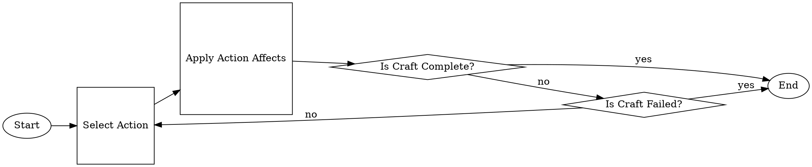

# Proposal - [PROJECT_NAME]

<!-- TODO: PROJECT_NAME -->

## Authors

- [Shannon Conneilly](mailto:Shannon_Conneilly@student.uml.edu)
- [Carlton Perkins](mailto:Carlton_Perkins@student.uml.edu)

## Problem Statement

## Problem Analysis

<!-- 
I know this won't render on GH right, but I can render the graph and upload as a png once its more set in stone

    In case you are not familiar, this is graphviz [dot](https://graphviz.org/about/)
 -->

### State Space

<!-- 
    All possible combinations of skills in a semi fixed depth. 

    Can we calculate this fixed number of actions that can be attempted?
-->

### State Transition

<!-- 
    The state is changed via preforming an action. This action may have affects, including increasing the quality of the item, increasing the progress of an item, consuming CP, starting a long-term buff, consuming and active buff, and passing or failing the craft.

    Some actions have a chance of success.
-->

### State Evaluation

<!-- Define a heuristic:
    Collectabilty?
    Actions to get a complete product
    Not failing a craft
    Final item quality
    Current buffs

    Could we collect all of the above to a numeric score that we can use genetic learning to tone to a 'correct' evaluation?
 -->

### Characteristics

<!-- 
    For Sure:
        Single agent
    
    Deterministic/stochastic:
    If we ignore the items that are chance based we can make this Deterministic which might be a good start for the project, though less accurate. Using the probabilities we can get the AI to play the game, but using the AI in the real world becomes a problem, so this is something that we might want to suggest in order for this to be practical. If the game allow for you to change game state at each step, this would allow the AI to follow the 'player' and its game state which then could be used in game

    The game is sequential by nature, and the end result is a combination of past choices and chance.

    The game State is Dynamic since things like the %Chance affects of a action can be modified outside of your control and between actions

 -->

## Dataset

<!-- 
    How are we going to transcribe the acquired data into machine usable formats?

    Do we export to a set of csvs? SQLLite?
    
    This data should contain
    -  All possible actions and effects
    -  Items to target
    -  Buffs and affects
 -->

## Deliverable

<!-- 
    Will the project have a GUI?
 -->

## Evaluation

<!-- 
    Whats the best way of defining success? Total 'value' of a craft? Simulated craft score in a leaderboard? 
 -->

## Schedule

<!-- 
    Component ideas
    - Data gathering/prep/sanitizing
      - How close is the current data to the real game?
    - Simulation
      - A Agent agnostic 'playable' craft simulator that can either be played with a GUI or though an automated AI
    - AI
      - Core
        - How will the bot 'play' the game
      - Training
        - How can we tweak/tune the bot to be better
        - Depending on the AI Core tech, this can be a genetic algorithm to tune magic values and modifiers in heuristics
 -->

## References

<!-- TODO Find these -->